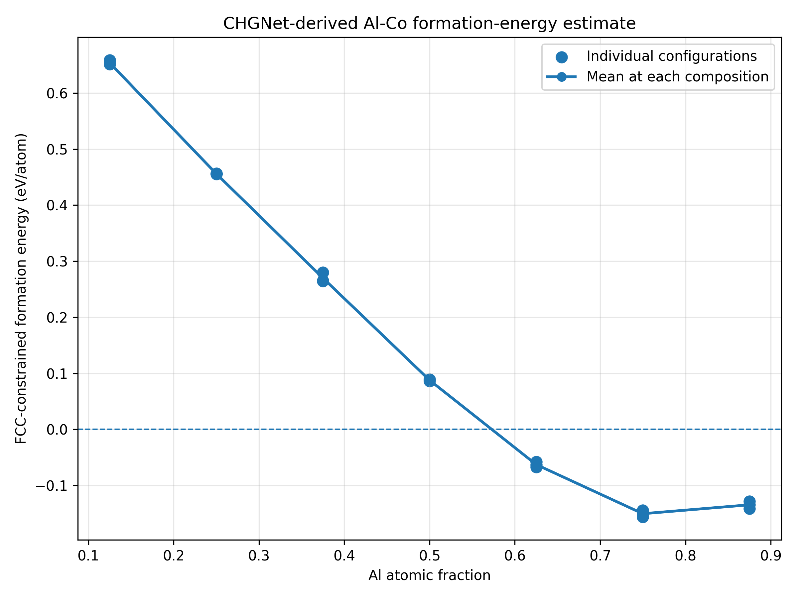
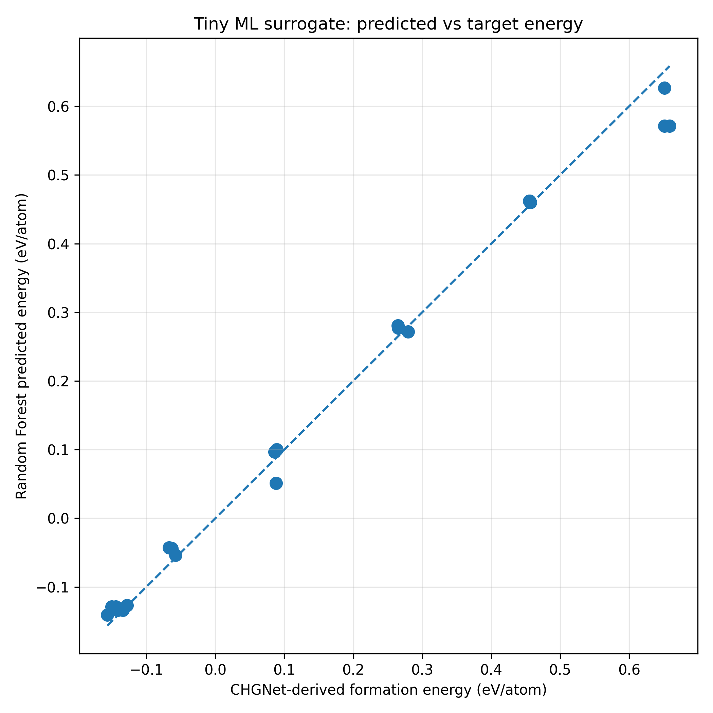

# Al-Co ML Energy Prediction

## Overview

This repository presents a small educational computational materials science workflow for Al-Co alloys using a pretrained machine-learning interatomic potential and a simple machine-learning regression model.

The project was developed as a **PhaseForge-inspired mini-project** to explore the connection between atomistic structure generation, machine-learned interatomic potentials, energy-based thermodynamic analysis, and surrogate machine-learning models.

The workflow is intentionally small and is intended to demonstrate the computational process rather than provide a complete thermodynamic assessment of the Al-Co system.

## Motivation

My previous research experience has primarily involved molecular dynamics simulations of metallic systems using LAMMPS. I developed this project to explore how atomistic calculations can be connected with machine learning and computational thermodynamics.

In particular, the project investigates how a pretrained machine-learning interatomic potential can be used to generate energy data for alloy configurations and how these data can subsequently be analyzed using simple thermodynamic quantities and machine-learning models.

## Workflow

```text
Random FCC Al-Co configurations
             |
             v
       CHGNet MLIP
             |
             v
    Static energy prediction
             |
             v
 Elemental reference energies
             |
             v
FCC-constrained formation-energy estimate
             |
             v
Local atomic pair descriptors
             |
             v
   Random Forest regression
             |
             v
 Predicted formation energies
```

## Dataset

A small dataset of **21 Al-Co configurations** was generated.

The structures were constructed from a 32-atom FCC supercell at seven compositions:

- Al = 0.125
- Al = 0.250
- Al = 0.375
- Al = 0.500
- Al = 0.625
- Al = 0.750
- Al = 0.875

For each composition, three different random Al/Co atomic arrangements were generated, resulting in:

```text
7 compositions × 3 configurations = 21 structures
```

The structures are stored as CIF files in:

```text
structures/generated/
```

## Methodology

### 1. Structure Generation

Atomic structures were generated using the Atomic Simulation Environment (ASE).

A 2 × 2 × 2 conventional FCC supercell containing 32 atoms was used as the parent structure. Al and Co atoms were randomly distributed over the lattice sites for the selected compositions.

### 2. ML Interatomic Potential

A pretrained **CHGNet** model was used as the machine-learning interatomic potential.

CHGNet was used to calculate the static energy of each of the 21 Al-Co configurations.

The calculated energies were stored in:

```text
data/chgnet_energy_dataset.csv
```

### 3. Elemental Reference Energies

Pure FCC Al and pure FCC Co structures were generated and evaluated using the same CHGNet model.

These elemental energies were used as reference values for calculating an energy-based thermodynamic descriptor.

### 4. FCC-Constrained Static Formation-Energy Estimate

For an Al-Co configuration with Al atomic fraction x, the energy estimate was calculated as:

```text
Delta E = E(Al-Co) - x E(Al) - (1-x) E(Co)
```

where all energies are expressed in eV/atom.

Because both alloy structures and elemental references were treated using an FCC-based static configuration and no structural relaxation was performed, the calculated quantity is described here as an:

**FCC-constrained static formation-energy estimate**

rather than a rigorous equilibrium formation enthalpy.

### 5. Structural Descriptors

Simple nearest-neighbor descriptors were extracted from each atomic configuration.

The machine-learning input features were:

- Al atomic fraction
- Al-Al nearest-neighbor pair fraction
- Al-Co nearest-neighbor pair fraction
- Co-Co nearest-neighbor pair fraction

These descriptors allow configurations having the same chemical composition but different local atomic arrangements to be distinguished.

### 6. Random Forest Regression

A Random Forest regression model was trained using the structural descriptors.

Five-fold cross-validation was used to obtain predictions for the small dataset.

The model is intended only as a demonstration of a simple surrogate machine-learning workflow.

## Results

### Formation Energy vs Composition

The calculated FCC-constrained static formation-energy estimates are shown below.



The three configurations at each composition can exhibit different energies because their local Al/Co atomic arrangements differ.

### Machine-Learning Regression

The Random Forest predictions were compared with the CHGNet-derived target values.



Cross-validation results:

```text
MAE  = 0.019639 eV/atom
RMSE = 0.029922 eV/atom
R²   = 0.989224
```

Because the dataset contains only 21 structures, these metrics should be interpreted as a workflow demonstration rather than evidence of a high-accuracy predictive model.

## Repository Structure

```text
AlCo_ML_Energy_Prediction/
│
├── structures/
│   ├── generate_alco_structures.py
│   ├── generate_reference_structures.py
│   ├── generated/
│   └── references/
│
├── calculations/
│   ├── calculate_chgnet_energies.py
│   └── calculate_reference_energies.py
│
├── analysis/
│   ├── calculate_formation_energies.py
│   ├── plot_formation_energy.py
│   ├── create_ml_features.py
│   └── train_tiny_ml_model.py
│
├── data/
├── figures/
├── requirements.txt
└── README.md
```

## Installation

The project was developed and tested using Python 3.12.

Create and activate a Python virtual environment, then install the required packages:

```bash
python -m pip install -r requirements.txt
```

## How to Run

Run the scripts from the main project directory in the following order.

### 1. Generate Al-Co structures

```bash
python structures\generate_alco_structures.py
```

### 2. Calculate CHGNet energies

```bash
python calculations\calculate_chgnet_energies.py
```

### 3. Generate elemental reference structures

```bash
python structures\generate_reference_structures.py
```

### 4. Calculate reference energies

```bash
python calculations\calculate_reference_energies.py
```

### 5. Calculate formation-energy estimates

```bash
python analysis\calculate_formation_energies.py
```

### 6. Plot formation energy

```bash
python analysis\plot_formation_energy.py
```

### 7. Generate ML descriptors

```bash
python analysis\create_ml_features.py
```

### 8. Train and evaluate the Random Forest model

```bash
python analysis\train_tiny_ml_model.py
```

## Limitations

This project is deliberately small and has several important limitations.

- Only 21 Al-Co atomic configurations are included.
- All alloy configurations originate from an FCC parent lattice.
- Structural relaxation was not performed.
- FCC elemental reference structures were used for both Al and Co.
- The reported energy quantity should therefore be interpreted as an FCC-constrained static formation-energy estimate.
- The ML regression model uses only simple composition and nearest-neighbor pair descriptors.
- No density-functional-theory validation was performed.
- Finite-temperature vibrational, electronic, magnetic, and configurational free-energy contributions were not included.
- The project does not constitute a complete Al-Co CALPHAD assessment or phase-diagram prediction.

## Possible Future Extensions

Several extensions could make the workflow more physically rigorous and closer to modern ML-assisted computational thermodynamics:

1. Relax the atomic positions and simulation cells using an ML interatomic potential before calculating formation energies.
2. Use appropriate relaxed ground-state elemental references, including FCC Al and HCP Co.
3. Generate more representative alloy configurations using approaches such as special quasirandom structures (SQS).
4. Increase the number of compositions, atomic configurations, and structure types.
5. Construct a candidate 0 K convex hull using relaxed formation energies.
6. Benchmark multiple machine-learning interatomic potentials.
7. Validate selected MLIP energies using density-functional-theory calculations.
8. Replace simple pair statistics with more advanced atomistic descriptors.
9. Use composition-aware or leave-one-composition-out validation.
10. Introduce uncertainty quantification and active-learning strategies for selecting new calculations.
11. Investigate finite-temperature thermodynamic contributions.
12. Explore integration of MLIP-derived thermodynamic data with CALPHAD model fitting and pycalphad-compatible thermodynamic databases.

## Relation to PhaseForge

This mini-project was motivated by the atomistic-to-thermodynamic research direction represented by **PhaseForge**.

The project explores only a simplified portion of that workflow:

```text
atomic structures
      ->
ML interatomic potential
      ->
energy data
      ->
thermodynamic descriptor
      ->
simple surrogate model
```

It does **not** implement PhaseForge itself, CALPHAD parameter optimization, ATAT workflows, Bayesian inference, active learning, or thermodynamic database generation.

Those capabilities represent possible directions for future study.

## References

1. Deng, B. et al. *CHGNet as a pretrained universal neural network potential for charge-informed atomistic modelling*. Nature Machine Intelligence, 2023.

2. Zhu, Sarıtürk, and Arróyave. *Machine Learning Potentials for Alloys: A Detailed Workflow to Predict Phase Diagrams and Benchmark Accuracy*. npj Computational Materials, 2025.

3. PhaseForge — open-source computational thermodynamics project, Texas A&M University.
